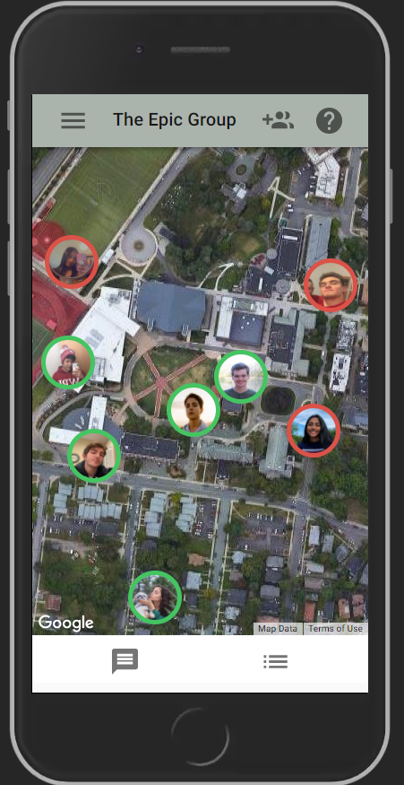

# WYA?

This is a project that allows for groups of friends to see which of their friends are free, where they are, and provides a platform for them to communicate directly.

This project is currently available here: [https://cs3041.s3.amazonaws.com/index.html#/](https://cs3041.s3.amazonaws.com/index.html#/). Please visit this site on a mobile device or simulated device, as it does not look nearly as good on desktop. 

## Dependencies and how to build this project yourself

This project requires `node.js` and `yarn` to be installed.

Once these two are installed, navigate to the route directory of this project in your favorite terminal.
If you have not run this project before, run `yarn install`. Once you have run this command, run `yarn start` to locally host it. If you would like to build this project to deploy to your own server, please run `yarn build`.

